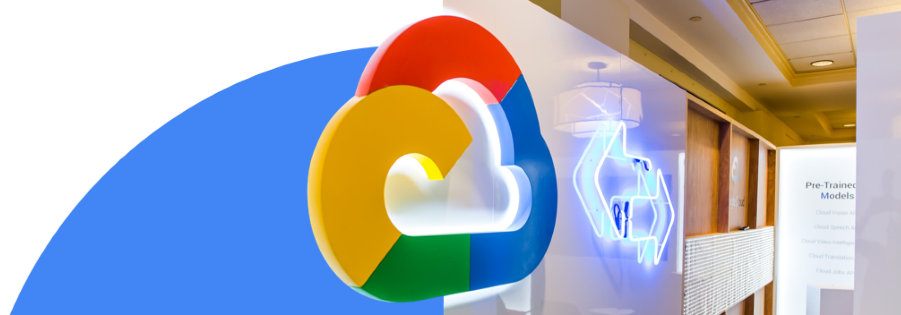
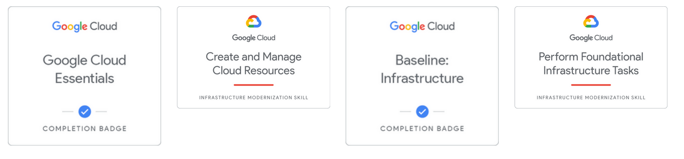
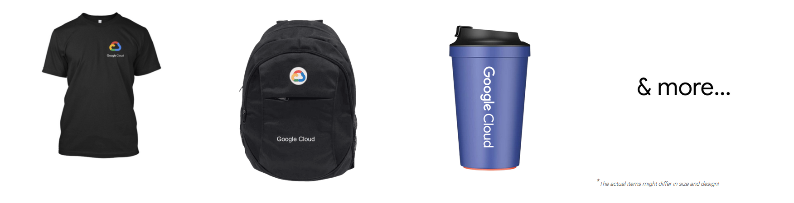

    <h1>GoogleCloudReady Facilitator Program</h1>
    <a href="https://dot-space.github.io/GCRF-22/">Home</a>
    &nbsp;
    <a href="https://dot-space.github.io/GCRF-22/prize">Prize Rules</a>
    &nbsp;
    <a href="https://dot-space.github.io/GCRF-22/faqs">FAQs</a>
    &nbsp;
    <a href="https://dot-space.github.io/GCRF-22/tnc">Terms and Conditions</a>
    &nbsp;
    <a href="https://dot-space.github.io/GCRF-22/coc">Code of Conduct</a>
    &nbsp;
    <a href="https://dot-space.github.io/GCRF-22/team">Team</a>

---

 &nbsp; April 25, 2022 17:00 - June 25, 2022 23:59 &nbsp; &nbsp; &nbsp;  &nbsp; Remote, India

## What is GoogleCloudReady Facilitator program?

The GoogleCloudReady Facilitator program will provide you an opportunity to kickstart your career in cloud and get hands on practice on Google Cloud - the tool that powers apps like Google Search, Gmail and YouTube.

Along the way, you will learn & practice concepts like computing, application development, big data & machine learning using cloud & if you get stuck, you will have your "Facilitators" who are specially trained on Google Cloud to help. 😎

  

<a href="https://forms.gle/mTCHGw3cdEojdH4M6">
<button style="background-color: #1266f1; color: white; border-radius: 5px; width: 200px; height: 35px">ENROL NOW</button>
</a>

 

## Why should I enrol in the program?

There are a lot of things in store for you. We want to make sure that by the end of this program:

1. You can showcase what you've learned here to your professional network <b> using Google Cloud-hosted quest & skill badges (see below) </b> that you can add to your resume and professional profiles like LinkedIn. 🏆

 

See the difference between a quest & a skill badge <a href="https://services.google.com/fh/files/emails/diff_quests_skillbadges.png">here</a>

     
    
2. And on top of these amazing badges, get a chance to <b> win some really cool Gooogle Cloud goodies\* 💪</b>. See [Prize Rules](https://dot-space.github.io/GCRF-22/prize) section

## Program's Syllabus

The program will introduce you to Computing, Application Development, Big Data & Machine Learning using Google Cloud's training platform called <a href="https://www.cloudskillsboost.google/" target="_blank"> Google Cloud Skills Boost </a>where you will learn each of these topic using self-paced labs that provides you temporary credentials to Google Cloud Platform, so you can learn the cloud using the real thing – no simulations.

For convinience, we have divided the topics above into 4 different tracks - starting from the most basic.

  

<ul style="list-style-type:disc">

<li><a href="https://dot-space.github.io/GCRF-22/track_1">Track 1 : Cloud Infrastructure Track</a></li>

 

<li><a href="https://dot-space.github.io/GCRF-22/track_2">Track 2 : Cloud-native Application Development Track</a></li>

 

<li><a href="https://dot-space.github.io/GCRF-22/track_3">Track 3 : Big Data & Machine Learning Track</a></li>

 

<li><a href="https://dot-space.github.io/GCRF-22/track_4">Track 4 : Security, Machine Learning & AI</a></li>

</ul>

---

<footer>

 All data on this site is copy righted to Google

Copyright ©️ <a href="bit.ly/crf-site">GoogleCloudReady Facilitator Program</a>

</footer>
