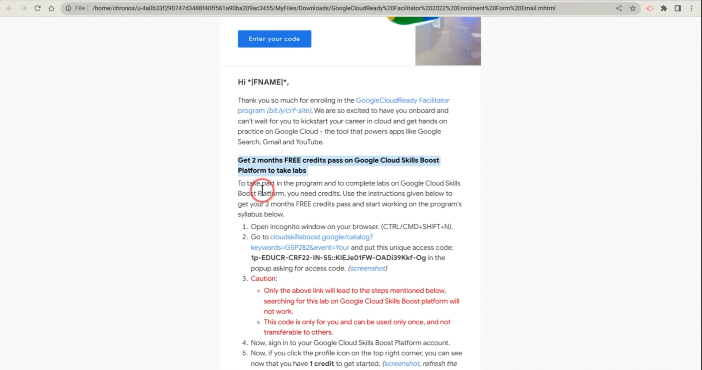

# GoogleCloudReady Facilitator Program

    <a href="https://dot-space.github.io/GCRF-22/">Home</a>
    &nbsp;
    <a href="https://dot-space.github.io/GCRF-22/prize">Prize Rules</a>
    &nbsp;
    <a href="https://dot-space.github.io/GCRF-22/faqs">FAQs</a>
    &nbsp;
    <a href="https://dot-space.github.io/GCRF-22/tnc">Terms and Conditions</a>
    &nbsp;
    <a href="https://dot-space.github.io/GCRF-22/coc">Code of Conduct</a>
    &nbsp;
    <a href="https://dot-space.github.io/GCRF-22/team">Team</a>

---

## Frequently Asked Questions

Already enrolled in the program? Here’s what you should know.

 

    
General Program related Questions

    
 

<b>What is the eligibility criteria for enrolling in the program?</b>

You need to meet these requirements if you want enrol in the program:
 

1. You need to have access to a working internet connection & a laptop with latest chrome browser.
    
2. You need to be above 18 years of age and enrolled in an higher education institution in India.
    
3. You need to be a student in the institutions selected by Google or must have been referred by any of the "Facilitators" that are part of the program.

 

<b>I did not receive an invitation email after applying through the Enrolment form. What should I do?</b>

Here's what youc an do:
 

1. Please wait for 24 hours after filling the form and you will surely receive your email.
    
2. Check for the email under your <b>SPAM/JUNK/PROMOTIONS</b> folder.
    
3. Just reach out to your Facilitators and they will help you get the instructions and enrol you in the program.

 

<b> I have completed the required quests and/or skill badges. When will I get my prizes?</b>

   If you have completed any of the milestones mentioned in the Prize Rules section and are eligible for prizes, then you will get them delivered to you within 2 months after the program is finished. (Provided that you have shared with us your correct contact information.)

 

<b> I have achieved all the milestones in the program. Will I get the goodies associated wiith each of them?</b>

   Please note that we will evlaute your progress at the end of the program and you will only get the goodies for the milestone that you achieve & not for the ones before that.

 

<b> Are students who participated in earlier iterations of 30 Days of Google Cloud program and/or GoogleCloudReady Facilitator program eligible for the program?</b>

   Note that any student who have already received schwags and the prizes in the earlier 30 Days of Google Cloud program and/or GoogleCloudReady Facilitator program are not eligible to get any prizes even if they complete any of the milestones.

 

<b> I have already completed the quests & the skill badges in the program, what should I do?</b>

   Please note that in order to get the prizes, you need to complete the quests and skill badges after your enrolment date. Any quests/skill badges completed before that won't be counted. If you want, you can make a new account on Google Cloud Skills Boost with a new email ID and enrol in the progam using that email ID instead.

 

<b>I need to make some changes to the my registration details in the enrolment form, but it's closed now? What should I do?</b>

   Note that we DO NOT allow changes to be made to the enrolment form once its closed. Though you can still reach out to your "Facilitators" and share the correct information with them. They can share that information with us and we can then decide to update the details or not based on the type of request.  

 

<b> Where will the schwags be delivered - to my address or to my college address?</b>

   Please note that you are required to submit your own residentials address where we can send the schwags once you win something. We will not be sending out your schwags to your institution unless absolutely required.

 

<b> Will students receive any certificate after completing any milestone in the program?</b>

   Note that as part of the program students will get digital badges from Google on their Google Cloud Skills Boost profile once they complete a quest or a skill badges. There are no separate certificates for the participating students.Though we will be sending a hard copy of a small "Thank you" card to all the students who wins a prize in the program

 

<b> The links are not working in my enrolment email. What should I do?</b>

   Sometimes due to how you have setup your email inbox, the links in the enrolment email might come out to be broken. Please do not worry about this. You can just copy and paste the hardcoded URLs in your browser added beside each link in the email and those should work too.

 

---

    
Google Cloud Skill Boost Queries

    
 

<b> I am not able to get the Google Cloud Skills Boost credits pass after enrolling in the program, what to do?</b>

   You can try the following solutions:
    
   <ul style="list-style-type:disc">
   <li>Here is a helpful video that will tell you how to get the credits pass.
   <li>If you have just completed the lab, then please wait for a few minutes and refresh your chrome browser tab a few times.
   <li>Start the lab again wait for 5 minutes and end the lab and then check again.
   <li>Reach out to your Facilitator and they will help you here.
   <li>Reach out to the Google Cloud Skills Boost Chat support via the home page. (You will need to click on the help button "?" alongside your profile icon on the top right corner when logged-in in order to access chat support)
   <li>Just drop an email to <a src="gcrfacilitator@qwiklabs.com">gcrfacilitator@qwiklabs.com</a>.
   </ul>

 

<b>I am stuck! I need help with Google Cloud Skills Boost, what should I do?</b>

   Here a few ways you can get unstuck:
    

1. Always reach out to your Facilitators first. They are the subject matter experts here who are specifically trained by Google for this program and they will be able help you with most of your queries.
    
2. Just reach out to the Google Cloud Skills Boost chat support or drop them an email at <a src="gcrfacilitator@qwiklabs.        com">gcrfacilitator@qwiklabs.com</a>.
    

<b> How to find my Google Cloud Skills Boost Public Profile URL?</b>

   Find the instructions to get the link to your Google Cloud Skills Boost Public Profile <a src="here">here</a> or you can just follow the steps given below. Here's what it should look like - "https://www.cloudskillsboost.google/public_profiles/PROFILE_ID".
    
1. Log-in to https://www.cloudskillsboost.google/.
    
2. Once logged-in, then go to https://www.cloudskillsboost.google/profile/activity.
    
3. Now click on the blue button "Make badge profile public" besides your account picture and then "Make Profile Public" if       there's a pop-up.
    
4. Give some time for the page to load. Once it loads, you will be on your profile page. Now just share the browser URL below. (That's your profile URL)
    
   TROUBLESHOOT: If in step 3, you did not see the button to make your profile public, then go to <a src="https://www.cloudskillsboost.google ">https://www.cloudskillsboost.google/focuses/2793?parent=catalog</a> and start the A Tour of Google Cloud Hands-on Labs" lab. (Spend at least 5 minutes) Once done, come back to <a src="https://www.cloudskillsboost.google/users/sign_in">https://www.cloudskillsboost.google/profile/activity and the button will be enabled now.</a>

<b>Why is my Google Cloud Skills Boost account blocked and how to get it unblocked?</b>

   If you try to use the resources which are not intended to be used in the lab the account will get blocked. See our official support article here to get more clarity on why this happened.

Here are a few examples which may lead to use resource out of the lab scope:

- Creating an extra VM instance than the set limit for maximum number of instances you can launch in the Cloud Console for the lab.
- Creating more number of nodes which are not intended to be created for the lab in the Cloud Console for the lab
- Specifying extra number of cores in the machine types with higher computing power.
- Running different commands which may lead to launch of extra resources other than the lab scope.

The above mentioned are few examples which can get your account blocked, if you are doing anything similar, mentioned in the above examples your account can get blocked as a result of those actions as well." Please reach out to gcrfacilitator@qwiklabs.com to get it unblocked.

 

<b> Why does my Google Cloud Skills Boost page shows a red banner with "Quota Expired"?</b>

   As part of the credits pass, you have 5 attempts for each lab in the program. If you a try a lab more than 5 times, then your quota gets expired. To rest your quita, please reach out to <a src="gcrfacilitator@qwiklabs.com">gcrfacilitator@qwiklabs.com</a>.

 

<b> I have followed the steps in the email to get the credits pass, still I have not received it, what should I do?</b>

   Please repeat the steps again but this time in an incognito window and do remember to keep in mind the instructions given in the Google Cloud Skills Boost related FAQs above and you will surely get your credits. <a src ="Here is a video">Here is a video</a> that will help you get the pass..

 

<b> How to take a lab on Google Cloud Skills Boost?</b>

   Just see the video tutorial here to get started -  <a src="https://www.youtube.com/watch?v=cyp7soKLOYI">https://www.youtube.com/watch?v=cyp7soKLOYI</a>

 

<b>What is a Quest?</b>

   A quest is a learning path that contains a number of hands-on labs. Complete a quest to earn a badge. Google Cloud Skills Boost Quests are learning paths that consist of a collection of labs organized by technologies, specific cloud services, and practical use cases. Quests range from introductory to advanced level.

 

<b> What is the difference between a Google Cloud Skills Boost Quest & a Google Cloud Skill Badge?</b>

   A Google Cloud Skills Boost quest is basically a group of labs using which you can learn and practice the concepts of Google Cloud on GCP. Whereas a Skill Badge for that quest, will help you test the skills that you have learned through a challenge lab. You can find more differences <a src="here">here</a>.

 

<b> How can I update my profile picture in Google Cloud Skills Boost?</b>

   Just follow the instrsuctions given  <a src="here">here</a>.

 

<b> How to share badges on Social media?</b>

   "1. Make your profile public.
    
   2. Right-click View Public Profile and select copy link address.
    
   3. Create links on your social media pages or resume.
     
   Tip: On LinkedIn, add your badge as a certification."

 
<b> How to check if I had successfully completed my last lab?</b>

   Please check lab completions on the profile activity page of your Google Cloud Skills Boost account. You may refer to the <a src="https://www.cloudskillsboost.google/profile/activity ">https://www.cloudskillsboost.google/profile/activity page</a>.

<b> I accidently deleted my Google Cloud Skills Boost Public profile and now the URL of the profile is changed. How should I udpate my details?</b>

   Please note that once the enrolment form is closed, you won't be able to update your new profile URL. But you can still try and share your updated URL with your facilitators and ask them to share it with us and we can then decide to update the details or not based on the type of request.

---

    
How to Reedem Credits

 

